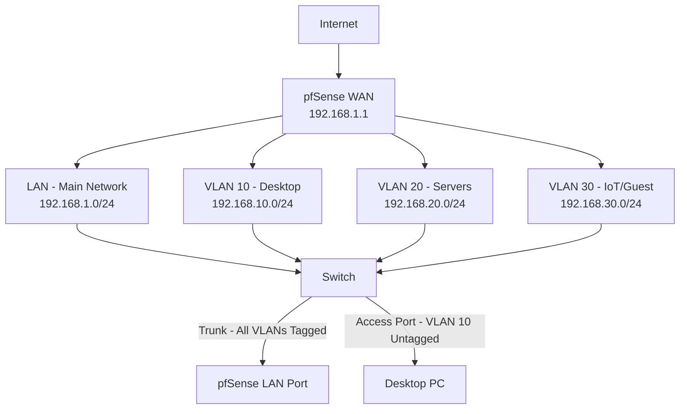

# VLAN Setup Guide in pfSense 2.8

**Author:** Greg Diny

A step-by-step guide to configuring VLANs in pfSense for network segmentation. This guide picks up where [Installing a Firewall](installing-pfsense.md) left off — if you haven't set up your RFC1918 alias yet, do that first before continuing.

---

## What We're Building

VLANs let you divide a single physical network into isolated logical segments, each with its own IP space and firewall rules. In this guide we'll create VLAN 10 for a desktop PC — isolated from other network segments but able to reach pfSense services and the internet.



> **Key concept:** The link between pfSense and your switch carries *all* VLANs as tagged traffic (trunk). Each device port on the switch carries only *one* VLAN as untagged traffic (access). As you add more VLANs, you only need to update the trunk port's allowed VLAN list — the device ports stay the same.

---

## Step 1: Create the VLAN Interface

1. Log in to the pfSense WebGUI at `192.168.1.1`
2. Navigate to **Interfaces → Assignments → VLANs**
3. Click **Add** and fill in:

   | Field | Value |
   |-------|-------|
   | Parent Interface | Your LAN NIC (e.g., `igb0`) |
   | VLAN Tag | `10` |
   | Description | `VLAN10_Desktop` |

4. Click **Save**
5. Go to **Interfaces → Assignments**
   - In the *Available Network Ports* dropdown, select the VLAN you just created
   - Click **+ Add**, then click the new interface name (it will appear as `OPT1` or similar)
   - Fill in:

   | Field | Value |
   |-------|-------|
   | Enable | ✓ |
   | Description | `Desktop` |
   | IPv4 Configuration Type | Static IPv4 |
   | IPv4 Address | `192.168.10.1 /24` |
   | IPv6 | None |

6. Click **Save → Apply Changes**

---

## Step 2: Enable DHCP

1. Navigate to **Services → DHCP Server → Desktop**
2. Check **Enable DHCP server on this interface**
3. Set the range:

   | Field | Value |
   |-------|-------|
   | Start | `192.168.10.100` |
   | End | `192.168.10.199` |
   | DNS Servers | Leave blank — pfSense hands out `192.168.10.1` automatically |

4. Optionally add **Static Mappings** for devices that need a pinned IP (e.g., Desktop NIC MAC → `192.168.10.10`)
5. Click **Save**

---

## Step 3: Update DNS Resolver and NTP

These services need to know the new interface exists.

- **Services → DNS Resolver** — set *Network Interfaces* to `All` or add `Desktop` explicitly. Save/Apply.
- **Services → NTP** — set *Interface(s)* to `All` or include `Desktop`. Save.

---

## Step 4: Configure Firewall Rules

This is the most important step. A common mistake is setting a blanket `Allow All` rule on a new VLAN — this lets it talk to your other VLANs and defeats the purpose of segmentation. Instead we'll build a proper ruleset from the start.

Navigate to **Firewall → Rules → Desktop** and add the following rules **in this exact order, top to bottom**. pfSense evaluates rules from the top down and stops at the first match.

### Rule 1 — Block Lateral Movement

Prevents this VLAN from reaching any other private network (your other VLANs, main LAN, etc.).

| Field | Value |
|-------|-------|
| Action | Block |
| Interface | Desktop |
| Protocol | Any |
| Source | Desktop net |
| Destination | RFC1918 (Alias) |
| Description | Block Desktop → RFC1918 (no lateral movement) |

> This rule relies on the RFC1918 alias created in the previous guide. If you skipped that step, go to **Firewall → Aliases → Add** and create a Network alias named `RFC1918` containing `10.0.0.0/8`, `172.16.0.0/12`, and `192.168.0.0/16`.

### Rule 2 — Allow DNS

Permits DNS queries to pfSense so name resolution works.

| Field | Value |
|-------|-------|
| Action | Pass |
| Protocol | TCP/UDP |
| Source | Desktop net |
| Destination | This Firewall |
| Destination Port | `53` (DNS) |
| Description | Desktop → pfSense DNS |

### Rule 3 — Allow NTP (Optional)

Permits time sync requests to pfSense.

| Field | Value |
|-------|-------|
| Action | Pass |
| Protocol | UDP |
| Source | Desktop net |
| Destination | This Firewall |
| Destination Port | `123` (NTP) |
| Description | Desktop → pfSense NTP |

### Rule 4 — Allow Internet

Permits outbound traffic to the internet. Because Rule 1 already blocks RFC1918 addresses, any traffic that reaches this rule is destined for a public IP.

| Field | Value |
|-------|-------|
| Action | Pass |
| Protocol | Any |
| Source | Desktop net |
| Destination | Any |
| Description | Desktop → Internet |

Click **Save and Apply Changes**.

> **NAT note:** If you're using Automatic Outbound NAT (the default), internet access for this VLAN works without any additional configuration. If you've switched to Manual Outbound NAT, add a rule under **Firewall → NAT → Outbound** to translate `192.168.10.0/24` out your WAN interface.

---

## Step 5: Configure Your Switch

Your managed switch needs to know which ports belong to which VLANs. The exact interface varies by switch model, but the logic is the same everywhere.

### Uplink Port (Switch → pfSense)

This port carries all VLANs as tagged traffic.

| Setting | Value |
|---------|-------|
| Mode | Trunk (Tagged) |
| Allowed VLANs | Default VLAN + all VLANs (update this list as you add more) |

### Device Port (Switch → Desktop)

This port carries only VLAN 10, untagged.

| Setting | Value |
|---------|-------|
| Mode | Access (Untagged) |
| VLAN ID | `10` |

> **Important:** Every time you add a new VLAN in pfSense, remember to add it to the trunk port's allowed VLAN list on the switch. Forgetting this is a common reason a new VLAN won't get traffic.

---

## Step 6: Verify the Desktop

1. Plug the desktop into the VLAN 10 access port on the switch
2. The desktop should receive an IP via DHCP automatically
3. Verify the configuration:
   - IP address in range `192.168.10.100–199`
   - Gateway: `192.168.10.1`
4. Run connectivity tests:

```bash
# Test pfSense VLAN gateway
ping 192.168.10.1

# Test internet connectivity
ping 8.8.8.8

# Test DNS resolution
ping google.com

# Confirm isolation — this should FAIL (expected)
ping 192.168.1.1
```

That last ping failing is a good sign — it means your block rule is working and the desktop can't reach other network segments.

---

## Verification Checklist

- ✅ VLAN interface created with static IP `192.168.10.1/24`
- ✅ DHCP server enabled and handing out addresses
- ✅ DNS Resolver and NTP updated to include the new interface
- ✅ Firewall rules block lateral movement, allow DNS/NTP, allow internet
- ✅ Switch trunk port updated to carry VLAN 10
- ✅ Desktop access port assigned to VLAN 10

---

## Troubleshooting

**No IP address assigned**
- Verify DHCP is enabled on the Desktop interface in pfSense
- Check the switch access port is set to VLAN 10 untagged
- Confirm the device NIC is set to obtain an IP automatically

**Can't reach the internet**
- Check Rule 4 (Allow Internet) is present and below the block rule
- Verify the pfSense gateway is configured under System → Routing
- Test DNS separately: `ping 8.8.8.8` (no DNS needed) vs. `ping google.com` (needs DNS)

**Can't access pfSense GUI**
- Verify Rule 2 (Allow DNS) permits traffic to This Firewall
- Check the anti-lockout rule is still enabled under Firewall → Rules → Desktop
- Confirm you're using the correct gateway IP (`192.168.10.1`)

**VLAN can reach other VLANs**
- Check Rule 1 (Block RFC1918) is at the **top** of the rule list
- Confirm the RFC1918 alias contains all three private ranges
- Verify you clicked Apply Changes after saving the rules

---

*This guide was developed through hands-on implementation in my home lab. All steps were personally tested with pfSense 2.8.*
